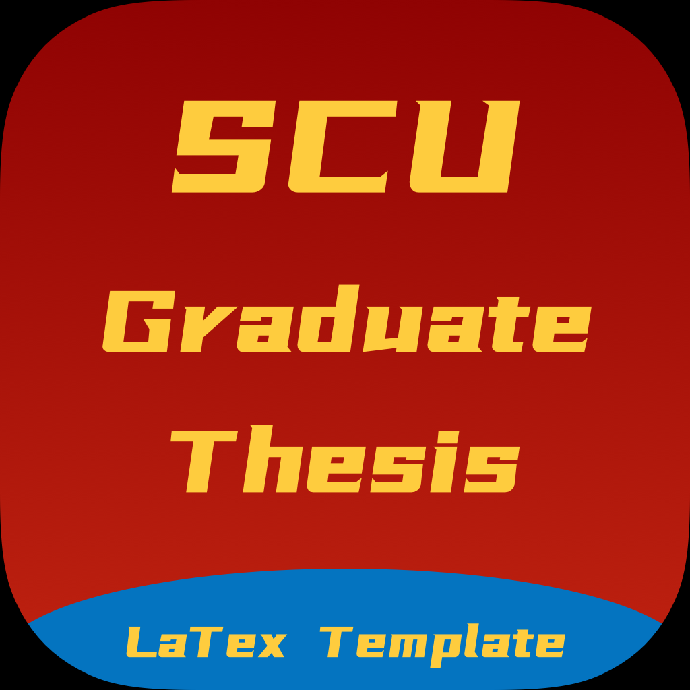
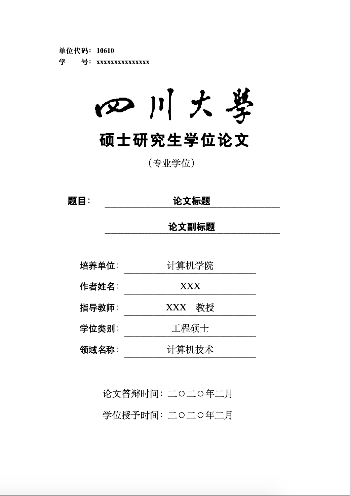
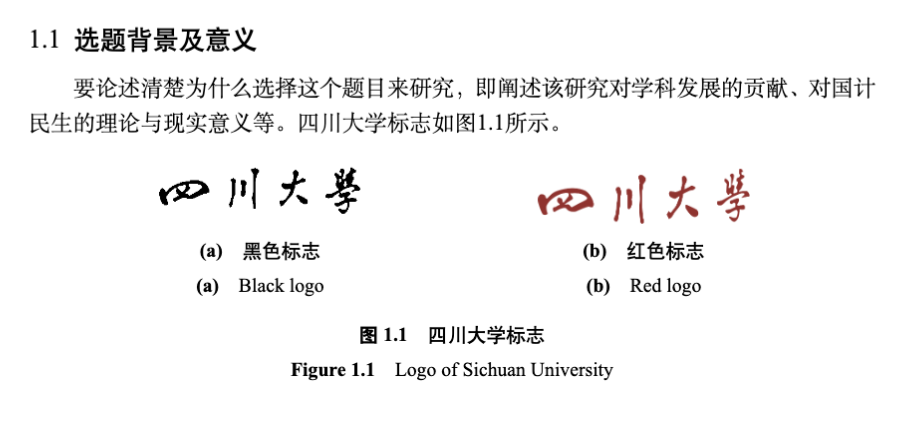

<div align="center"><p>
    <span style="font-size: 14px">Version: 2020.02</span><br>
    <span>"2020年四川大学研究生学业论文LaTex模版"</span><br>
    <span style="font-size: 12px;color= #95dafc">-- Modified by <a>Kevin T. Lee</a> --</span>
    </p>
   <a href="./License"></a>
        <a href="http://lidengju.com"></a>
    <a href="https://github.com/kevinleeex/scu_thesis_2020"></a>
</div>


# 四川大学2020研究生学业论文LaTex模版

根据学院给的Word模版2020版需求，并基于fork的旧版库样式，改写了模版。

SCU graduate thesis latex template.

## :warning:NOTICE

现在发现几处给出范例与描述不一致，已根据理解修改，如下：

- 页眉说明为**五号**字，范例为**小五**，修改为小五。
- 一些标题描述间隔一个汉字符，范例为一个空格符，修改为空格符。
- 封面页校名标题没有居中，修改为居中。
- 描述中公式居中，范例为右对齐，修改为居中。
- 没有保留封面等内容的说明内容。
- 部分内容由于排版软件的关系有些微差别。

> 如您发现更多问题请您提交ISSUES，或PR。

## Features

- [x] 🍞 通过配置项自动生成不同类型的论文格式
- [x] 🍔 「像素级」复刻原Word模版
- [x] :beer:  通过```\incite``` 来进行行内引用
- [x] :apple: bicaption图片双语题注示例
## Options

| 参数         | 说明                       |
| ------------ | -------------------------- |
| professional | 专业学位                   |
| academic     | 学术学位                   |
| master       | 硕士                       |
| docter       | 博士                       |
| approval     | 送审版本，不生成声明和致谢 |
| color        | 红色川大logo，默认为黑色   |

## Release Notes

See [Releases](https://github.com/kevinleeex/scu_thesis_2020/releases)

## Previews


图片引用示例：



## Getting Started

### Prerequisites

The following softwares you should installed before build the project.

- TexLive
- MacTex(on mac)
- Visual Studio Code (optional) with LaTex workshop plugin

### Installation

Clone the project.

```bash
cd path-to-dir
git clone https://github.com/kevinleeex/scu_thesis_2020.git
code scu_thesis_2020
```

### Usage

Open and edit the ```MainBody.tex```

```shell
% 设置文档属性
% 参数说明
% professional: 专业学位
% academic: 学术学位
% master: 硕士
% doctor: 博士
% approval: 送审版本，将不生成声明
% color: 红色川大logo
% 打开MainBody.tex根据需要填入
\documentclass[professional,master]{./Template/scuthesis2020}
```

Use **xelatex** compile the LaTex file with the recipe of ```xe->bib->xe->xe``` .

## Powered By

- *pkuthss-1.2beta* 
- [cuiao's template](https://github.com/cuiao/SCU_ThesisDissertation_LaTeXTemplate)

I would like to extend my sincere gratitude to the authors and contributors of the open source libraries above.

## Support me

If this project helps you, you can support me to do better.  
<a href="https://paypal.me/kevinleeex"></a>

Or click <a href="http://lidengju.com/donate">Donete me</a> with Wechat or Alipay

And Star/ISSUE/PR are welcome.

## License

Copyright © 2020 Modified by [Kevin T. Lee](http://lidengju.com). All rights reserved. 

The project is licensed under the GPL license. See [LICENSE](./License/) for more details.
