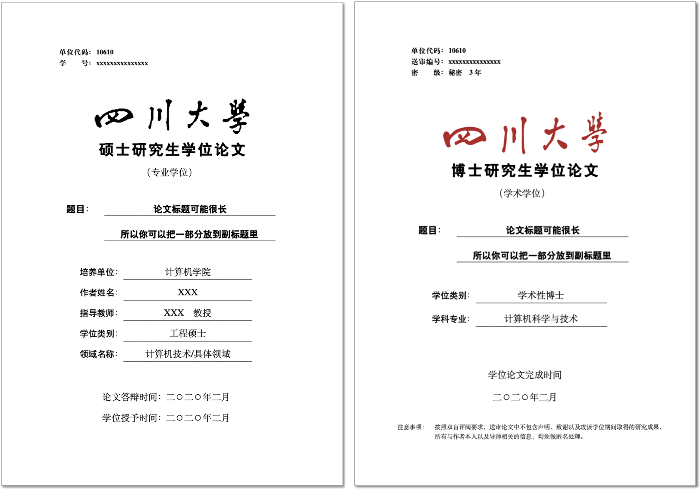

<div align="center"><p>
    <span style="font-size: 14px">Version: 2022.03.03</span><br>
    <span>"2020年四川大学研究生学业论文LaTex模版"</span><br>
    <span style="font-size: 12px;color= #95dafc">-- Modified by <a>Kevin T. Lee</a> --</span>
    </p>
   <a href="./License"></a>
        <a href="http://lidengju.com"></a>
    <a href="https://github.com/kevinleeex/scu_thesis_2020"></a>
</div>


# 四川大学2020研究生学业论文LaTex模版

SCU graduate thesis latex template.

根据学院给的2020版《研究生学位论文规范写作指南》Word模版需求([参见PDF](./Reference%20Document/1-3%20《研究生学位论文规范写作指南》.pdf))，制作的LaTex模版。

使用该模版的多篇论文经受了2020/21年硕、博士论文评审的考验，请放心食用！

**该模板已到稳定版本，可直接下载使用[scu_thesis_2022_03_03](https://github.com/kevinleeex/scu_thesis_2020/releases/download/v2022.03.03/scu_thesis_2022_03_03.zip)中的最新模板。**

- **如果你习惯在Overleaf中写作，可以参考[相关链接](#overleaf用户)。**

- 独立的模版样式文件，[scu_thesis_template](https://github.com/kevinleeex/scu_thesis_template)，可用于替换```./Template```目录用于更新样式。

**国内网速不好可使用**Gitee**镜像:**

- [scu_thesis_2020](https://gitee.com/kevinleeex/scu_thesis_2020)
- [scu_thesis_template](https://gitee.com/kevinleeex/scu_thesis_template)

克隆后修改```.gitmodules```文件内容如下：

```
[submodule "Template"]
    path = Template
    url = https://gitee.com/kevinleeex/scu_thesis_template.git
```

## :warning:NOTICE

现在发现几处给出范例与描述不一致，已根据理解修改，如下：

- 页眉说明为五号字，范例为小五，修改为**小五**。
- 一些标题描述间隔一个汉字符，范例为一个空格符，修改为**一个汉字符**。
- 封面页校名标题没有居中，修改为**居中**。
- 描述中公式居中，范例为右对齐，修改为**居中**。
- 描述中图和表题注都为宋体加粗，范例的表为黑体，修改为**宋体加粗**
- 描述中偶数页页眉为论文题目，范例为学校名+论文类型，修改为**论文题目**。
- 没有保留封面等内容的说明内容。
- 部分内容由于排版软件的关系有些微差别。
- 使用插图/表格目录，假如图题/表题中有引用，请注意最后的引用顺序，若出现正文的第一个引用不是从[1]开始，请清理临时文件，重新编译。

> 如您发现更多问题请您提交ISSUES，或PR。
>
> **免责声明：本项目开源用于格式参考，本模版的作者和贡献者不承担任何人使用该模版所引发的任何问题(如格式审查等)。**

## Features

- [x] 🍞 通过配置项自动生成不同类型的论文格式，你专注内容就好
- [x] 🍔 「像素级」复刻原Word模版
- [x] 🧀  通过```\incite``` 来进行行内引用
- [x] 🍟 ```\bicaption```图片双语题注示例
- [x] 🍕 ```\cdash```公式说明的破折号
- [x] 🌮 ```\cref```智能参考
- [x] 🥘 ```\tabincell```多行单元格
- [x] 🍗 ```\makefigtablist```添加图表目录

## Options

| 参数         | 说明                       |
| ------------ | -------------------------- |
| professional | 专业学位                   |
| academic     | 学术学位                   |
| master       | 硕士                       |
| docter       | 博士                       |
| approval     | 送审版本，不生成声明和致谢 |
| secret       | 保密论文，将显示密级       |
| color        | 红色川大logo，默认为黑色   |
|kfont=        | 字体库，可根据操作系统填写，Mac OS X推荐填入kfont=mac以解决字重问题|

## Release Notes

See [Releases](https://github.com/kevinleeex/scu_thesis_2020/releases)

- [2020-02-19] 将Template作为[子模块](https://github.com/kevinleeex/scu_thesis_template)方便样式的后续更新。 
- [2021-11-27] 增强对2019以上Tex Live中CTEX的兼容性。
- [2022-03-03] **推荐**[scu_thesis_2022_03_03](https://github.com/kevinleeex/scu_thesis_2020/releases/download/v2022.03.03/scu_thesis_2022_03_03.zip)点击下载。
  - 增加了`\incite`命令的说明配置，可以进行带说明的行内引用了

## Previews

封面示例：



## Getting Started

### Prerequisites

在你构建项目之前，需要先安装以下的软件。

- TexLive (2019)
- MacTex(on mac)
- Visual Studio Code (optional) with LaTex workshop plugin

### Installation

克隆项目。

```bash
cd path-to-dir
git clone https://github.com/kevinleeex/scu_thesis_2020.git
cd scu_thesis_2020
git submodule init
git submodule update --remote
```

**后续通过```git submodule update --remote```命令 更新样式子模块到最新版本，强制更新加上```-f```参数，合并更新加上```--merge```参数。**

### Usages

打开并编辑 ```MainBody.tex```

```shell
% 设置文档属性
% 参数说明
% professional: 专业学位
% academic: 学术学位
% master: 硕士
% doctor: 博士
% approval: 送审版本，将不生成声明
% secret: 保密论文，将显示密级
% color: 红色川大logo
% kfont=<⟨none|adobe|fandol|founder|mac|macnew|macold|ubuntu|windows|windowsnew|windowsold|...⟩>，
% 不填写则默认fandol
% 打开MainBody.tex根据需要填入
\documentclass[professional,master]{./Template/scuthesis2020}

% 在./Chapters/ 文件夹中写作，在MainBody.tex中包含
% 在./Chapters/Statement.tex 中撰写中文声明
% 在./Chapters/0_0_Abstract.tex 中撰写摘要
% 在./Chapters/Achievements.tex 中撰写学术成果
% 在./Chapters/Thanks.tex 中撰写致谢
% 在./ReferenceDocument/ 文件夹中，存放用于参考的文献
% 在./ReferenceBase.bib 文件中存放bibTex引用
```

使用 **xelatex** 编译 LaTex 文件，执行```xeLatex->bibTex->xeLatex->xeLatex``` 方案.

#### Linux 与 macOS 用户

推荐使用本模版提供的 ```Makefile``` 进行编译，可以使用如下几条可用的命令：

```shell
make all                      # 执行清理、编译pdf、清理过程
make pdf                      # 编译生成 MainBody.pdf
make clean                    # 删除编译所产生的辅助文件
make cleanall                 # 删除 MainBody.pdf 和所有辅助文件
make wordcount                # 论文字数统计
```

#### Windows 用户

对于 Windows 用户，模版提供了编译脚本```Compile.bat```。可以双击直接编译，也可以在命令提示符窗口中使用脚本提供的额外功能：

```shell
.\Compile.bat thesis          # 编译生成 MainBody.pdf
.\Compile.bat clean           # 删除编译所产生的辅助文件
.\Compile.bat cleanall        # 删除 MainBody.pdf 和所有辅助文件
.\Compile.bat wordcount       # 论文字数统计
```

#### Overleaf用户

可以通过[在线查看](https://www.overleaf.com/read/mdcwrzbkmcjb)来进行预览，也可以下载后作为自己的Overleaf项目，注意设置编译器为**xeLatex**，已经对高版本Tex Live进行兼容！

### Tips

- 通过**Detexify**软件，可以通过手写来识别符号，给出相应的Latex符号标记。
- 通过**Mathpix Snipping Tool**软件，可以通过截屏公式，来生成相应的Latex公式代码。
- 通过**pandoc**命令行程序，可以将Tex文件生成其他格式文件，如```docx```，可以用于查重等。
  ```bash
  pandoc -s MainBody.tex -o MainBody.docx --bibliography=ReferenceBase.bib
  ```

## Powered By

- [cuiao's template](https://github.com/cuiao/SCU_ThesisDissertation_LaTeXTemplate)

向以上项目表示感谢。

## Support me

如果您喜欢这个项目可以点个Star，或提出Issue或通过PR提交有用的新特性，也欢迎推荐给其他人使用，这对我和项目都是很大的激励。

或者点击<a href="http://lidengju.com/donate">打赏我</a> 通过支付宝或微信请我喝杯奶茶。 

## License

Copyright © 2020 Modified by [Kevin T. Lee](http://lidengju.com). 版权所有。

项目基于GPL开源协议，查看 [LICENSE](./License/) 获取详细内容。
